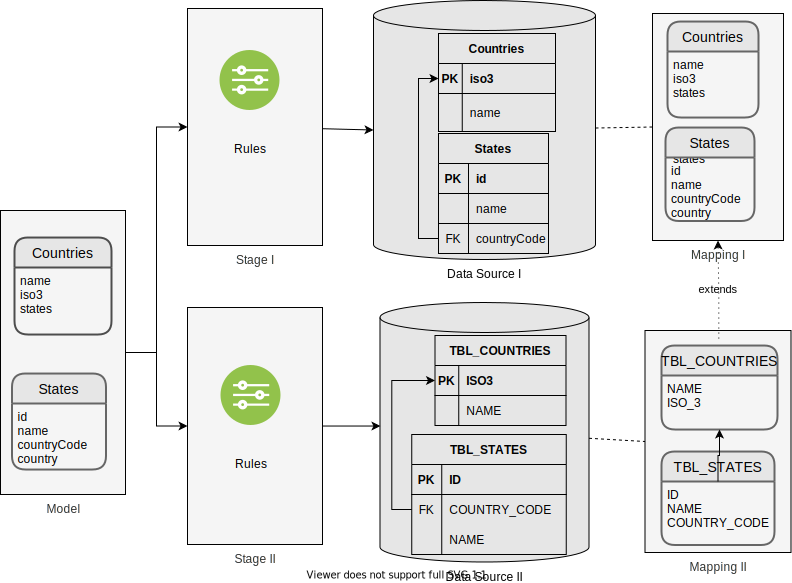

# Lab 03

In this laboratory we will see:

- how to work with two data sources with different mappings
- how to define two stages and work with them
- How to insert data from a file to more than one table.
- how to use data imported from one stage to import it to another

## Schema diagram

In this scheme we can see how to extend the schema.



## Pre requirements

### Create database for test

Create file "docker-compose.yaml"

```yaml
version: '3'
services:
  mysql:
    container_name: lambdaorm-mysql
    image: mysql:5.7
    restart: always
    environment:
      - MYSQL_DATABASE=test
      - MYSQL_USER=test
      - MYSQL_PASSWORD=test
      - MYSQL_ROOT_PASSWORD=root
    ports:
      - 3306:3306
  postgres:
    container_name: lambdaorm-postgres
    image: postgres:10
    restart: always
    environment:
      - POSTGRES_DB=test
      - POSTGRES_USER=test
      - POSTGRES_PASSWORD=test
    ports:
      - '5432:5432'
```

Create MySql and Postgres databases for test:

```sh
docker-compose up -d
```

Create user and set character:

```sh
docker exec lambdaorm-mysql  mysql --host 127.0.0.1 --port 3306 -uroot -proot -e "ALTER DATABASE test CHARACTER SET utf8 COLLATE utf8_general_ci;"
docker exec lambdaorm-mysql  mysql --host 127.0.0.1 --port 3306 -uroot -proot -e "GRANT ALL ON *.* TO 'test'@'%' with grant option; FLUSH PRIVILEGES;"
```

### Install lambda ORM CLI

Install the package globally to use the CLI commands to help you create and maintain projects

```sh
npm install lambdaorm-cli -g
```

## Test

### Create project

will create the project folder with the basic structure.

```sh
lambdaorm init -w lab_03
```

position inside the project folder.

```sh
cd lab_03
```

### Complete Schema

In the creation of the project the schema was created but without any entity.
Add the Country entity as seen in the following example

```yaml
entities:
  - name: Countries
    primaryKey: ["iso3"]
    uniqueKey: ["name"]
    properties:
      - name: name
        nullable: false
      - name: iso3
        length: 3
        nullable: false
    relations:
      - name: states
        type: manyToOne
        composite: true
        from: iso3
        entity: States
        to: countryCode
  - name: States
    primaryKey: ["id"]
    uniqueKey: ["countryCode", "name"]
    properties:
      - name: id
        type: integer
        nullable: false
      - name: name
        nullable: false
      - name: countryCode
        nullable: false
        length: 3
    relations:
      - name: country
        from: countryCode
        entity: Countries
        to: iso3
mappings:
  - name: mapping1
  - name: mapping2
    entities:
      - name: Countries
        mapping: TBL_COUNTRIES
        properties:
          - name: iso3
            mapping: ISO3
          - name: name
            mapping: NAME
      - name: States
        mapping: TBL_STATES
        properties:
          - name: id
            mapping: ID
          - name: name
            mapping: NAME
          - name: countryCode
            mapping: COUNTRY_CODE
dataSources:
  - name: dataSource1
    dialect: mysql
    mapping: mapping1
    connection:
      host: localhost
      port: 3306
      user: test
      password: test
      database: test
  - name: dataSource2
    dialect: postgres
    mapping: mapping2
    connection:
      host: localhost
      port: 5432
      user: test
      password: test
      database: test
stages:
  - name: stage1
    dataSources:
      - name: dataSource1
  - name: stage2
    dataSources:
      - name: dataSource2		
```

### Update

```sh
lambdaorm update
```

the model will be created in file src/models/countries/model.ts .

### Sync

```sh
lambdaorm sync -s stage1
lambdaorm sync -s stage2
```

It will generate:

- the Counties and States tables in database test and a status file "stage1-state.json" in the "data" folder.
- the TBL_COUNTRIES and TBL_STATES tables in database test2 and a status file "stage2-state.json" in the "data" folder.

### Popuplate Data

then we execute

```sh
lambdaorm run -e "Countries.bulkInsert().include(p => p.states)" -d ./data.json -s stage1
lambdaorm run -e "Countries.bulkInsert().include(p => p.states)" -d ./data.json -s stage2
```

test:

```sh
lambdaorm run -e "Countries.page(1,10).include(p => p.states)" -s stage1
lambdaorm run -e "Countries.page(1,10).include(p => p.states)" -s stage2
```

### Delete data in Countries and states in stage2

```sh
lambdaorm run -e "States.deleteAll()" -s stage2
lambdaorm run -e "Countries.deleteAll()" -s stage2
```

test:

```sh
lambdaorm run -e "Countries.page(1,10).include(p => p.states)" -s stage2
```

### Export data from stage1

```sh
lambdaorm export  -s stage1
```

### Import in stage2 from data exported from stage1

```sh
lambdaorm import -d ./stage1-export.json -s stage2
```

test:

```sh
lambdaorm run -e "Countries.page(1,10).include(p => p.states)" -s stage2
```

### Drop

remove all tables from the schema and delete the state file stage1-state.json and stage2-state.json

```sh
lambdaorm drop -s stage1
lambdaorm drop -s stage2
```

## End

### Remove database for test

Remove MySql database:

```sh
docker-compose down
```
